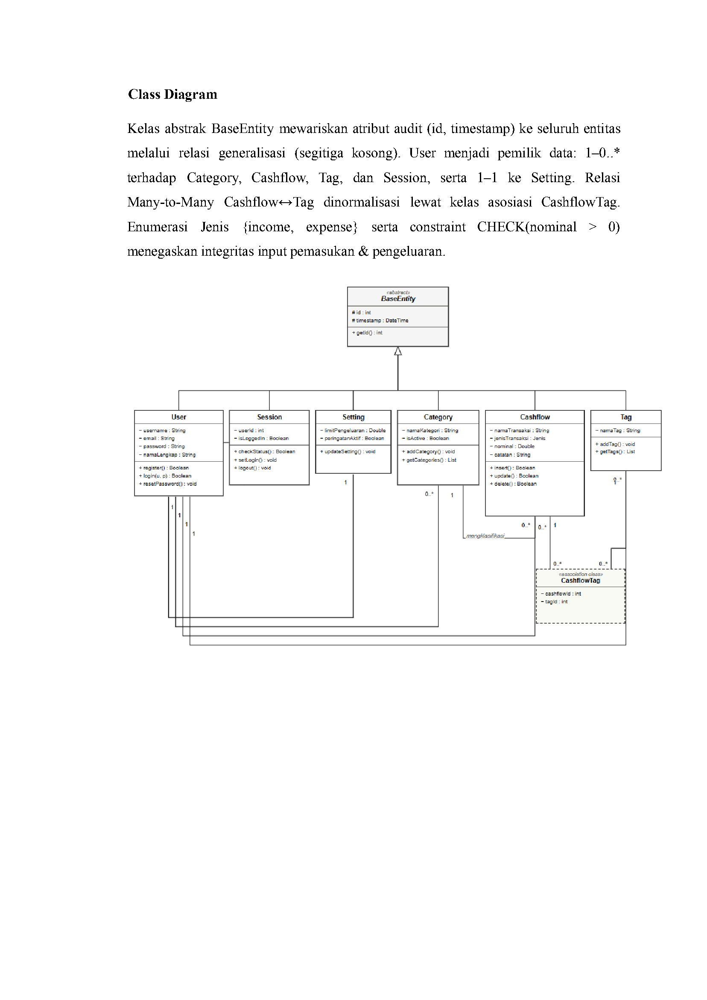
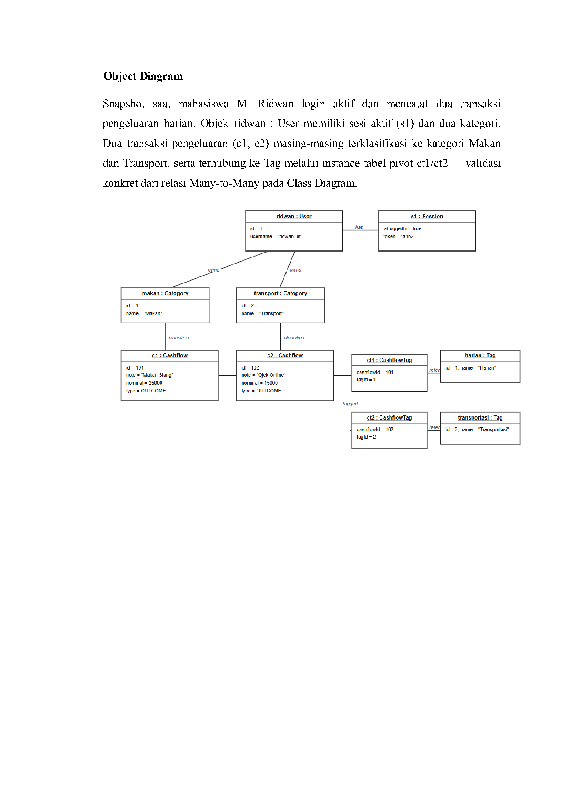
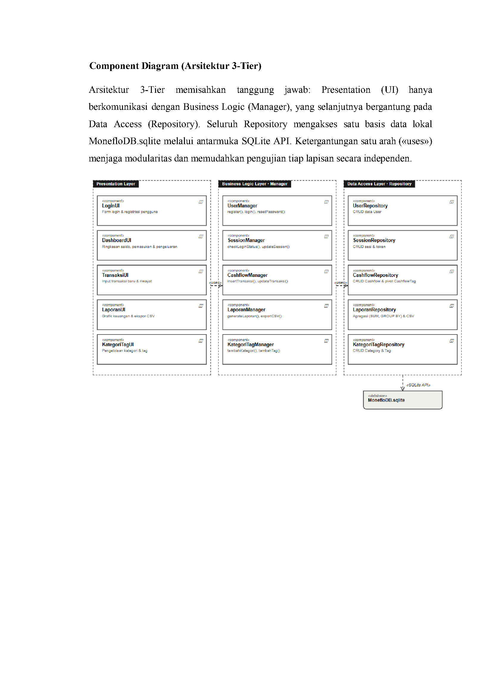
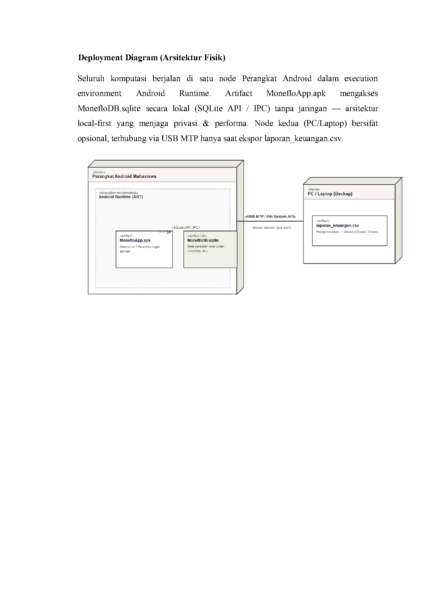
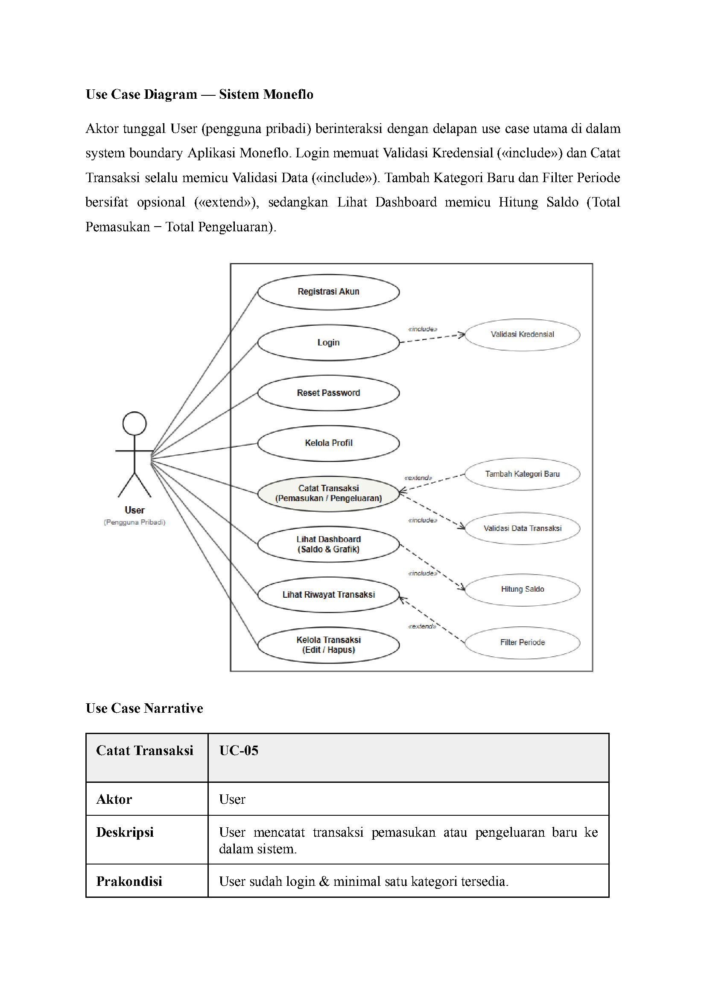
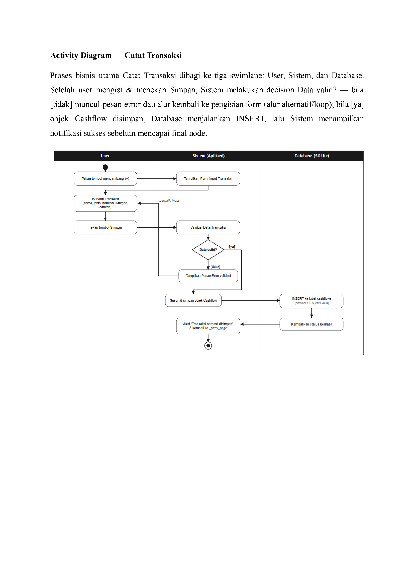
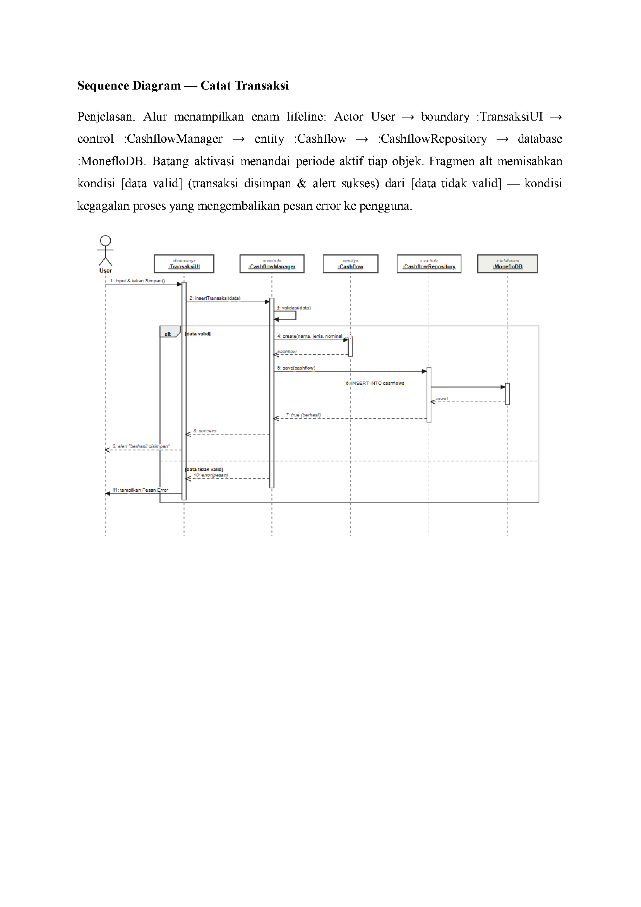
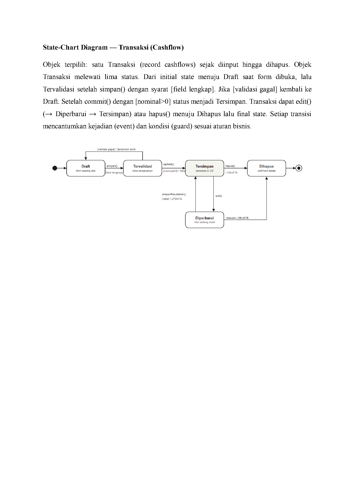
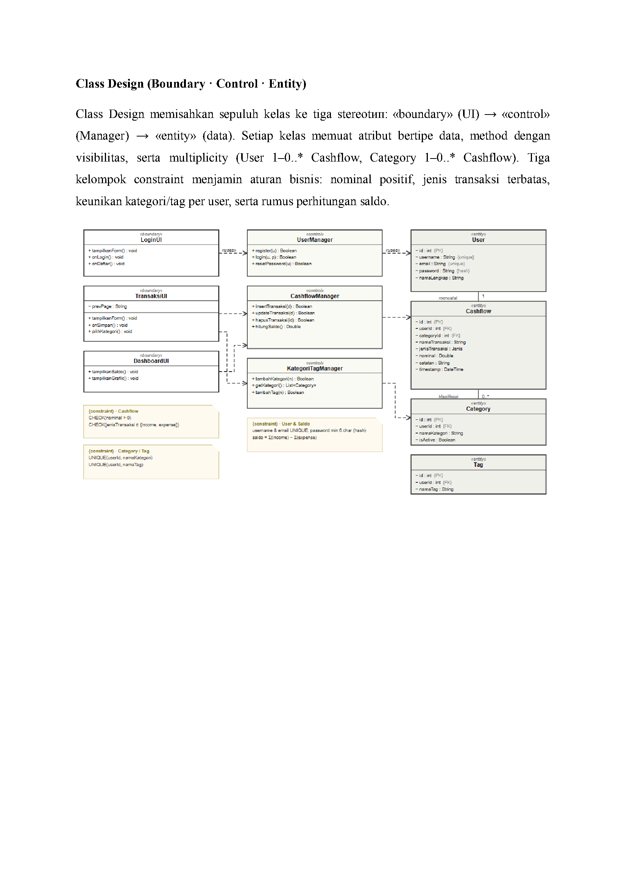
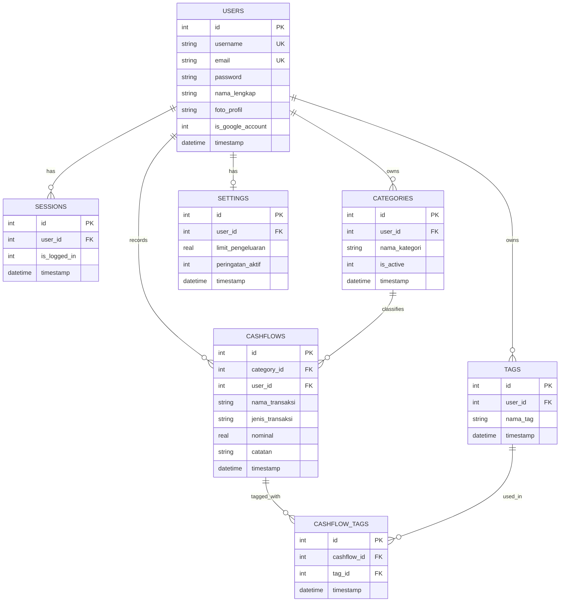

# Laporan OOAD — Moneflo

**Analisa dan Perancangan Berorientasi Objek — Studi Kasus Aplikasi Pencatatan Keuangan "Moneflo"**

Dosen Pengampu: Eka Hidayat, M.Kom. — TIF K 24A, Kelompok 3, Tahun Ajaran 2025/2026

| Nama | NPM |
|---|---|
| M. Ridwan Nurfauzi | 24552011204 |
| Hilvan Yadhisnata | 24552011163 |
| Iqbal Kadian | 25552012024 |
| Tanri Vebriansyah | 23552011384 |

Laporan lengkap (PDF asli, apa adanya dari mata kuliah OOAD) tersedia di [`Laporan_OOAD_Kelompok3.pdf`](Laporan_OOAD_Kelompok3.pdf). Ringkasan tiap diagram di bawah adalah isi laporan tersebut.

## Daftar Isi

1. [Ringkasan Revisi Milestone 2](#1-ringkasan-revisi-milestone-2)
2. [Class Diagram](#2-class-diagram)
3. [Object Diagram](#3-object-diagram)
4. [Component Diagram (Arsitektur 3-Tier)](#4-component-diagram-arsitektur-3-tier)
5. [Deployment Diagram (Arsitektur Fisik)](#5-deployment-diagram-arsitektur-fisik)
6. [Use Case Diagram](#6-use-case-diagram)
7. [Activity Diagram — Catat Transaksi](#7-activity-diagram--catat-transaksi)
8. [Sequence Diagram — Catat Transaksi](#8-sequence-diagram--catat-transaksi)
9. [State-Chart Diagram — Transaksi (Cashflow)](#9-state-chart-diagram--transaksi-cashflow)
10. [Class Design (Boundary · Control · Entity)](#10-class-design-boundary--control--entity)
11. [Entity Relationship Diagram (ERD)](#11-entity-relationship-diagram-erd)

---

## 1. Ringkasan Revisi Milestone 2

Bagian ini merevisi empat diagram struktural dari Milestone 2 (Class, Object, Component, dan Deployment Diagram). Perbaikan difokuskan pada konsistensi notasi UML, integritas relasi, dan penerapan prinsip berorientasi objek:

1. **Type-safety melalui Enumerasi** — Atribut `jenis_transaksi` dibatasi enumerasi `{income, expense}` melalui `CHECK` constraint dan `nominal` dijamin `> 0`, sehingga input pemasukan/pengeluaran tervalidasi hingga level basis data.
2. **Normalisasi Relasi Many-to-Many** — Relasi `Cashflow ↔ Tag` dinormalisasi melalui kelas asosiasi `CashflowTag` dengan multiplicity eksplisit (1 ke 0..*), memperbaiki integritas referensial (foreign key) pada basis data SQLite lokal.
3. **Enkapsulasi & Audit Trail** — Seluruh atribut ditetapkan `private (−)` dengan accessor `public (+)`, dan kelas abstrak `BaseEntity` ditambah atribut audit `createdAt` / `updatedAt` untuk pelacakan perubahan data secara konsisten.
4. **Konsistensi Penamaan Lintas Diagram** — Nama kelas, komponen, dan artefak diselaraskan di seluruh diagram (Object, Component, Deployment), misalkan `CashflowManager`, `CashflowRepository`, `MonefloDB.sqlite`, agar dapat ditelusuri antar-lapisan.

---

## 2. Class Diagram

Kelas abstrak `BaseEntity` mewariskan atribut audit (`id`, `timestamp`) ke seluruh entitas melalui relasi generalisasi (segitiga kosong). `User` menjadi pemilik data: 1–0..* terhadap `Category`, `Cashflow`, `Tag`, dan `Session`, serta 1–1 ke `Setting`. Relasi Many-to-Many `Cashflow ↔ Tag` dinormalisasi lewat kelas asosiasi `CashflowTag`. Enumerasi `Jenis {income, expense}` serta constraint `CHECK(nominal > 0)` menegaskan integritas input pemasukan & pengeluaran.

---

## 3. Object Diagram

Snapshot saat mahasiswa M. Ridwan login aktif dan mencatat dua transaksi pengeluaran harian. Objek `ridwan : User` memiliki sesi aktif (`s1`) dan dua kategori. Dua transaksi pengeluaran (`c1`, `c2`) masing-masing terklasifikasi ke kategori Makan dan Transport, serta terhubung ke `Tag` melalui instance tabel pivot `ct1`/`ct2` — validasi konkret dari relasi Many-to-Many pada Class Diagram.

---

## 4. Component Diagram (Arsitektur 3-Tier)

Arsitektur 3-Tier memisahkan tanggung jawab: **Presentation** (UI) hanya berkomunikasi dengan **Business Logic** (Manager), yang selanjutnya bergantung pada **Data Access** (Repository). Seluruh Repository mengakses satu basis data lokal `MonefloDB.sqlite` melalui antarmuka SQLite API. Ketergantungan satu arah (`«uses»`) menjaga modularitas dan memudahkan pengujian tiap lapisan secara independen.

---

## 5. Deployment Diagram (Arsitektur Fisik)

Seluruh komputasi berjalan di satu node **Perangkat Android** dalam execution environment Android Runtime. Artifact `MonefloApp.apk` mengakses `MonefloDB.sqlite` secara lokal (SQLite API / IPC) tanpa jaringan — arsitektur *local-first* yang menjaga privasi & performa. Node kedua (PC/Laptop) bersifat opsional, terhubung via USB MTP hanya saat ekspor `laporan_keuangan.csv`.

---

## 6. Use Case Diagram

Aktor tunggal **User** (pengguna pribadi) berinteraksi dengan delapan use case utama di dalam system boundary Aplikasi Moneflo. **Login** memuat *Validasi Kredensial* (`«include»`) dan **Catat Transaksi** selalu memicu *Validasi Data* (`«include»`). **Tambah Kategori Baru** dan **Filter Periode** bersifat opsional (`«extend»`), sedangkan **Lihat Dashboard** memicu *Hitung Saldo* (Total Pemasukan − Total Pengeluaran).

### Use Case Narrative — Catat Transaksi (UC-05)

| | |
|---|---|
| **Aktor** | User |
| **Deskripsi** | User mencatat transaksi pemasukan atau pengeluaran baru ke dalam sistem. |
| **Prakondisi** | User sudah login & minimal satu kategori tersedia. |
| **Pascakondisi** | Record baru tersimpan di tabel `cashflows`; saldo & dashboard diperbarui. |
| **Pemicu** | User menekan tombol mengambang (+). |
| **Alur Utama** | 1. User menekan FAB (+); sistem simpan `_prev_page`. 2. Sistem menampilkan Form Input (tanggal = hari ini). 3. User mengisi Nama, Jenis, Nominal, Kategori, Catatan. 4. User menekan Simpan. 5. Sistem memvalidasi data (`«include»`). 6. Sistem menyimpan ke `cashflows`. 7. Alert "Transaksi berhasil disimpan" & kembali ke `_prev_page`. |
| **Alur Alternatif** | 5a. Pilih "+ Tambah Kategori Baru" → dialog input → simpan ke `categories` (`«extend»`). |
| **Eksepsi** | E1. Nominal ≤ 0 / kosong → "Nominal harus lebih dari 0". E2. Nama Transaksi kosong → "Nama Transaksi wajib diisi". |

### Use Case Narrative — Login (UC-02)

| | |
|---|---|
| **Aktor** | User |
| **Deskripsi** | User masuk ke sistem menggunakan username & password. |
| **Prakondisi** | User sudah terdaftar di tabel `users`. |
| **Pascakondisi** | Sesi aktif (`is_logged_in = 1`); diarahkan ke Dashboard. |
| **Pemicu** | User menekan tombol Login. |
| **Alur Utama** | 1. Sistem menampilkan halaman Login. 2. User mengisi Username & Password (opsi "Tetap login"). 3. User menekan Login. 4. Sistem memvalidasi kredensial (`«include»`). 5. Jika "Tetap login": set semua `is_logged_in=0`, insert sesi baru `=1`. 6. Sistem mengarahkan ke Dashboard. |
| **Alur Alternatif** | 2a. "Lupa Password" → halaman Reset Password. 2b. "Daftar Pengguna" → halaman Registrasi. |
| **Eksepsi** | E1. Username tidak ada → "Username tidak ditemukan". E2. Password salah → "Password salah". |

---

## 7. Activity Diagram — Catat Transaksi

Proses bisnis utama Catat Transaksi dibagi ke tiga swimlane: **User**, **Sistem**, dan **Database**. Setelah user mengisi & menekan Simpan, Sistem melakukan decision *Data valid?* — bila **[tidak]** muncul pesan error dan alur kembali ke pengisian form (alur alternatif/loop); bila **[ya]** objek `Cashflow` disimpan, Database menjalankan `INSERT`, lalu Sistem menampilkan notifikasi sukses sebelum mencapai final node.

---

## 8. Sequence Diagram — Catat Transaksi

Alur menampilkan enam lifeline: `Actor User` → `boundary :TransaksiUI` → `control :CashflowManager` → `entity :Cashflow` → `:CashflowRepository` → `database :MonefloDB`. Batang aktivasi menandai periode aktif tiap objek. Fragmen `alt` memisahkan kondisi **[data valid]** (transaksi disimpan & alert sukses) dari **[data tidak valid]** — kondisi kegagalan proses yang mengembalikan pesan error ke pengguna.

---

## 9. State-Chart Diagram — Transaksi (Cashflow)

Objek terpilih: satu Transaksi (record `cashflows`) sejak diinput hingga dihapus. Objek Transaksi melewati lima status: dari *initial state* menuju **Draft** saat form dibuka, lalu **Tervalidasi** setelah `simpan()` dengan syarat **[field lengkap]**. Jika **[validasi gagal]** kembali ke Draft. Setelah `commit()` dengan **[nominal>0]** status menjadi **Tersimpan**. Transaksi dapat `edit()` (→ **Diperbarui** → **Tersimpan**) atau `hapus()` menuju **Dihapus** lalu *final state*. Setiap transisi mencantumkan kejadian (event) dan kondisi (guard) sesuai aturan bisnis.

---

## 10. Class Design (Boundary · Control · Entity)

Class Design memisahkan sepuluh kelas ke tiga stereotip: `«boundary»` (UI) → `«control»` (Manager) → `«entity»` (data). Setiap kelas memuat atribut bertipe data, method dengan visibilitas, serta multiplicity (`User` 1–0..* `Cashflow`, `Category` 1–0..* `Cashflow`). Tiga kelompok constraint menjamin aturan bisnis: nominal positif, jenis transaksi terbatas, keunikan kategori/tag per user, serta rumus perhitungan saldo.

---

## 11. Entity Relationship Diagram (ERD)

Dihasilkan dari skema SQLite aktual (`app/src/main/java/id/digikriya/moneflo/database/DatabaseHelper.kt`) — konsisten dengan Class Diagram di atas:

