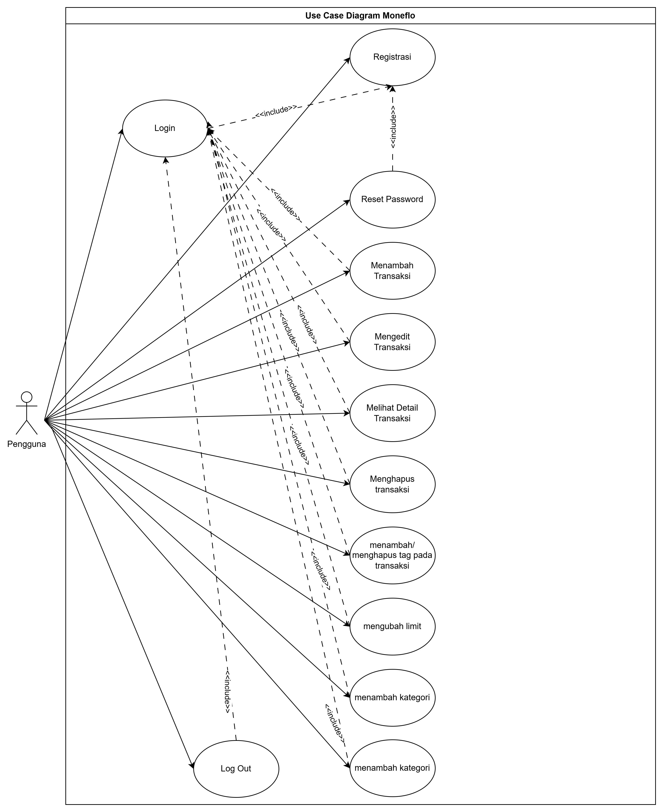
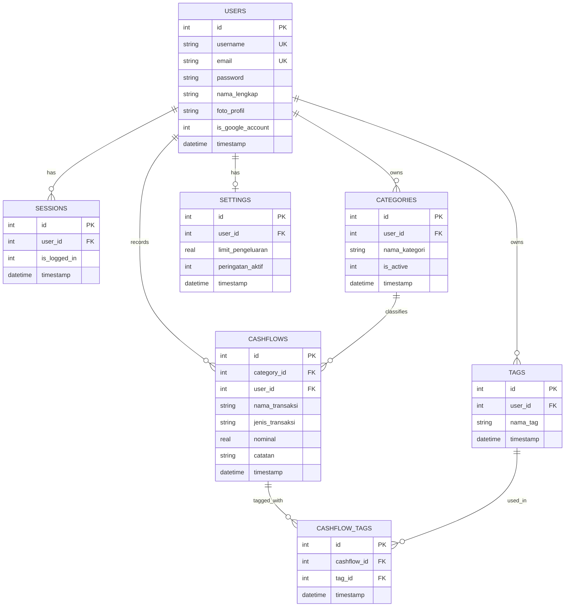

# Laporan OOAD — Moneflo

> **Catatan:** Folder ini menampung laporan Object-Oriented Analysis & Design (OOAD)
> **apa adanya dari mata kuliah OOAD** sesuai ketentuan soal UAS. Tempelkan/ekspor ulang
> dokumen OOAD kelompok Anda yang sudah dikerjakan di mata kuliah tersebut ke sini
> (boleh PDF, gambar, atau markdown). Bagian Entity Relationship Diagram di bawah sudah
> diisi otomatis berdasarkan skema database aktual di aplikasi ini sebagai starting point —
> silakan sesuaikan/lengkapi dengan diagram OOAD asli kelompok Anda (Class Diagram,
> Sequence Diagram, Activity Diagram, dst).

## Daftar Isi

1. [Use Case Diagram](#1-use-case-diagram)
2. [Class Diagram](#2-class-diagram)
3. [Entity Relationship Diagram (ERD)](#3-entity-relationship-diagram-erd)
4. [Sequence Diagram](#4-sequence-diagram)
5. [Activity Diagram](#5-activity-diagram)

---

## 1. Use Case Diagram

Sudah tersedia di `design/use-cases/use_case_diagram.jpg` (dirujuk juga dari README utama).

---

## 2. Class Diagram

> **TODO:** Tempelkan Class Diagram dari laporan OOAD kelompok di sini.
> Simpan gambar/export-nya di `ooad/diagrams/class_diagram.png` lalu referensikan:
>
> ``

Referensi kelas utama yang sudah diimplementasikan di kode (untuk membantu menyusun ulang Class Diagram):

- **Model** (`app/src/main/java/id/digikriya/moneflo/model/Models.kt`): `User`, `Session`, `Category`, `Setting`, `Cashflow`, `Tag`
- **Database** (`app/src/main/java/id/digikriya/moneflo/database/DatabaseHelper.kt`): `DatabaseHelper` (SQLiteOpenHelper) — mengelola seluruh operasi CRUD
- **Activity**: `SplashActivity`, `OnboardingActivity`, `LoginActivity`, `RegisterActivity`, `ForgotPasswordActivity`, `ResetPasswordActivity`, `DashboardActivity`, `HistoryActivity`, `StatisticsActivity`, `TransactionFormActivity`, `ProfileActivity`, `EditProfileActivity`, `ChangePasswordActivity`
- **Adapter**: `TransactionAdapter` (RecyclerView)
- **Helper**: `GoogleAuthHelper`, `ThemePrefs`, `BottomNavHelper`, `PhotoHelper`, `CategoryVisuals`, `DateGroupHelper`, `NotificationPopupHelper`, `ProfileMenuPopupHelper`

---

## 3. Entity Relationship Diagram (ERD)

Dihasilkan dari skema SQLite aktual (`DatabaseHelper.kt`):

---

## 4. Sequence Diagram

> **TODO:** Tempelkan Sequence Diagram dari laporan OOAD kelompok (misal: alur Login,
> alur Tambah Transaksi, alur Google Sign-In). Simpan di `ooad/diagrams/` dan
> referensikan seperti Class Diagram di atas.

---

## 5. Activity Diagram

> **TODO:** Tempelkan Activity Diagram dari laporan OOAD kelompok (misal: alur
> Registrasi → Validasi → Simpan, alur Tambah/Edit Transaksi). Simpan di
> `ooad/diagrams/` dan referensikan seperti Class Diagram di atas.
